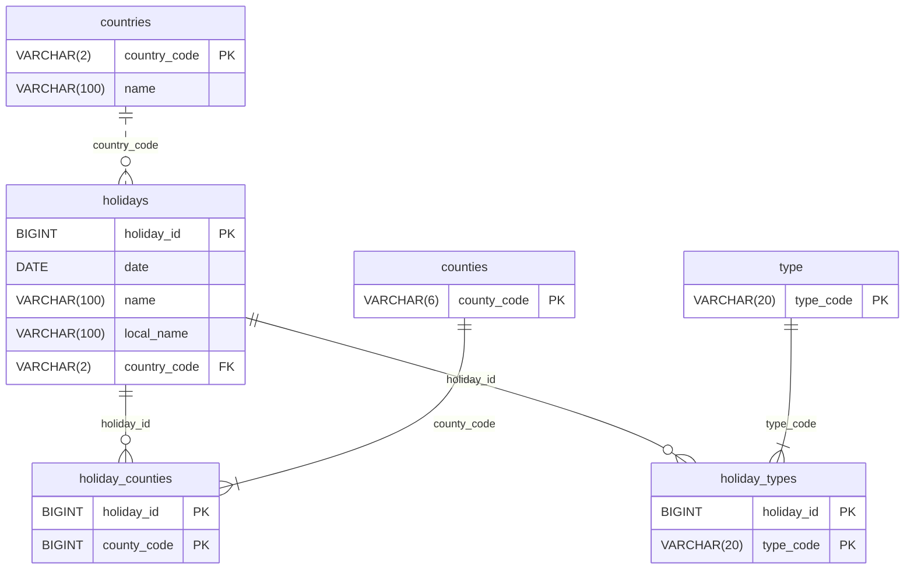

# 빌드 & 실행 방법

# 설계한 REST API 명세 요약

# ./gradlew clean test 성공 스크린샷

# Swagger UI 또는 OpenAPI JSON 노출 확인 방법

# 구현 과정

## 외부 API 살펴보기

### 국가목록
국가목록 API는 국가별 국가코드와 이름이 응답되는 것을 확인.

### 특정 연도 공휴일
> [공식 문서](https://date.nager.at/Api) 참조

특정 연도 공휴일 API는 다음과 같은 정보들이 응답되는 것을 확인.

- date: `yyyy-MM-dd` 형식의 날짜 
- localName: 해당 국가 기준 공휴일명
- name: 영문 공휴일명
- countryCode: 해당 국가 코드(ISO 3166-1 alpha-2)
- fixed: 매년 같은 날짜의 공휴일 유무, 공식문서 취소선 및 true인 예시 데이터도 false로 반환되는 것을 보아 현재는 쓰이지 않는 것으로 보임
- global: 국가적 공휴일 유무
- counties: 행정 구역(ISO-3166-2) 배열, global이 false인 경우
- launchYear: 공휴일 시작 연도, 공식문서 취소선은 없으나 시작 연도가 명시된 예시 데이터를 요청해보니 null로 반환되고 있음
- types: 공휴일 유형
  - Public: 공공
  - Bank: 은행
  - School: 학교
  - Authorities: 관공서
  - Optional: 선택 사항, 회사나 개인 재량으로 쉴 수 있는 날로 보임
  - Observance: 기념일이나 축제 등, 법적으로 쉴 수 있는 날은 아닌 것으로 보임

## ERD
> 공식문서와 실제 데이터 상 차이가 있는 `fixed`, `launchYear`은 제거
> 
> [mermaid](https://mermaid.js.org/syntax/entityRelationshipDiagram.html) 참조

# 체크리스트
- [ ] 기능 명세
  - [ ] 데이터 적재
    - [ ] 최근 5 년(2020 ~ 2025)의 공휴일을 외부 API에서 수집하여 저장 
    - [ ] 최초 실행시 시 5 년 × N 개 국가를 일괄 적재하는 기능 포함
  - [ ] 검색
    - [ ] 연도별/국가별 필터 기반 공휴일 조회
    - [ ] 필터 자유 확장
      - [ ] 기간 from ~ to
      - [ ] 공휴일 타입
    - [ ] 결과는 페이징 형태로 응답
  - [ ] 재동기화
    - [ ] 특정 연도/국가 데이터 재호출하여 덮어쓰기 가능
  - [ ] 삭제
    - [ ] 특정 연도/국가 공휴일 레코드 전체 삭제
  - [ ] 배치 자동화(선택)
    - [ ] 매년 1월 2일 01:00 KST에 전년도/금년도 데이터 자동 동기화
- [ ] README
  - [ ] 빌드 & 실행 방법
  - [ ] 설계한 REST API 명세 요약(엔드포인트, 파라미터, 응답 예시)
  - [ ] ./gradlew clean test 성공 스크린샷 (테스트 작성 시)
  - [ ] Swagger UI 또는 OpenAPI JSON 노출 확인 방법
