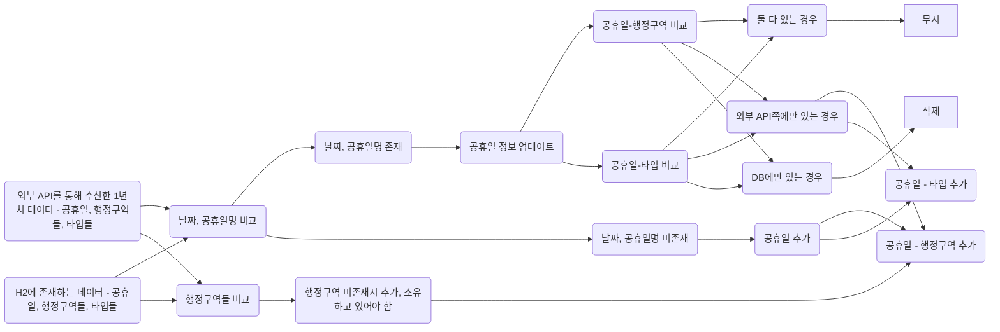

# 빌드 & 실행 방법

## 빌드

`./gradlew clean build`

## 실행

`java -jar build/libs/holiday_keeper-0.0.1-SNAPSHOT.jar`

# 설계한 REST API 명세 요약

## 공휴일 조회

### request

> GET /holidays?year=:year&countryCode=:countryCode&from=:from&to=:to&type=:type&countyCode=:countyCode&page=:page&size=:size

```http request
GET http://localhost:8080/holidays?year=25&countryCode=au&from=1&to=12&type=public&countyCode=au-act&page=0&size=20
```

### response

> 잘못된 쿼리 파라미터가 있다면 예외 메시지와 함께 400이 반환됩니다.

```http
HTTP/1.1 200 OK

{
  "content": [
    {
      "countryCode": "AU",
      "name": "Canberra Day",
      "localName": "Canberra Day",
      "date": "2025-03-10",
      "countyCodes": [
        "AU-ACT"
      ],
      "types": [
        "PUBLIC"
      ]
    },
    {
      "countryCode": "AU",
      "name": "Holy Saturday",
      "localName": "Easter Eve",
      "date": "2025-04-19",
      "countyCodes": [
        "AU-ACT",
        "AU-NSW",
        "AU-NT",
        "AU-QLD",
        "AU-SA",
        "AU-VIC"
      ],
      "types": [
        "PUBLIC"
      ]
    },
    {
      "countryCode": "AU",
      "name": "Easter Sunday",
      "localName": "Easter Sunday",
      "date": "2025-04-20",
      "countyCodes": [
        "AU-ACT",
        "AU-NSW",
        "AU-NT",
        "AU-QLD",
        "AU-SA",
        "AU-VIC",
        "AU-WA"
      ],
      "types": [
        "PUBLIC"
      ]
    },
    {
      "countryCode": "AU",
      "name": "Reconciliation Day",
      "localName": "Reconciliation Day",
      "date": "2025-06-02",
      "countyCodes": [
        "AU-ACT"
      ],
      "types": [
        "PUBLIC"
      ]
    },
    {
      "countryCode": "AU",
      "name": "King's Birthday",
      "localName": "King's Birthday",
      "date": "2025-06-09",
      "countyCodes": [
        "AU-ACT",
        "AU-NSW",
        "AU-NT",
        "AU-SA",
        "AU-TAS",
        "AU-VIC"
      ],
      "types": [
        "PUBLIC"
      ]
    },
    {
      "countryCode": "AU",
      "name": "Labour Day",
      "localName": "Labour Day",
      "date": "2025-10-06",
      "countyCodes": [
        "AU-ACT",
        "AU-NSW",
        "AU-SA"
      ],
      "types": [
        "PUBLIC"
      ]
    }
  ],
  "page": {
    "size": 20,
    "number": 0,
    "totalElements": 6,
    "totalPages": 1
  }
}
```

## 공휴일 동기화

### request

> PUT /holidays/{year}/{countryCode}

```http request
PUT http://localhost:8080/holidays/2025/KR
```

### response

```http
HTTP/1.1 200 OK
```

## 공휴일 삭제

### request

> DELETE /holidays/{year}/{countryCode}

```http request
DELETE http://localhost:8080/holidays/2025/KR
```

### response

```http
HTTP/1.1 204 No Content
```

# ./gradlew clean test 성공 스크린샷


# Swagger UI 또는 OpenAPI JSON 노출 확인 방법

> swagger 설정은 [이전에 작성한 swagger 설정글](https://velog.io/@eora21/restdocs-swaggerUI-설정하기)을 토대로 구성하였습니다.

build를 수행하면 `src/main/resources/static/docs` 경로에 swagger 파일이 생성됩니다.

스프링이 실행된 상태에서 확인하시려면 http://localhost:8080/docs/index.html 주소로 접속하시면 됩니다.

# 구현 과정 및 고민

## 외부 API 살펴보기

### 국가목록

국가목록 API는 국가별 국가코드와 이름이 응답되는 것을 확인했습니다.

### 특정 연도 공휴일

> [공식 문서](https://date.nager.at/Api)를 참조하였습니다.

특정 연도 공휴일 API는 다음과 같은 정보들이 응답되는 것을 확인했습니다.

- date: `yyyy-MM-dd` 형식의 날짜
- localName: 해당 국가 기준 공휴일명
- name: 영문 공휴일명
- countryCode: 해당 국가 코드(ISO 3166-1 alpha-2)
- fixed: 매년 같은 날짜의 공휴일 유무, 공식문서 취소선 및 true인 예시 데이터도 false로 반환되는 것을 보아 현재는 쓰이지 않는 것으로 보입니다.
- global: 국가적 공휴일 유무
- counties: 행정 구역(ISO-3166-2) 배열, global이 false인 경우
- launchYear: 공휴일 시작 연도, 공식문서 취소선은 없으나 시작 연도가 명시된 예시 데이터를 요청해보니 null로 반환되고 있었습니다.
- types: 공휴일 유형
  - Public: 공공
  - Bank: 은행
  - School: 학교
  - Authorities: 관공서
  - Optional: 선택 사항, 회사나 개인 재량으로 쉴 수 있는 날로 보입니다.
  - Observance: 기념일이나 축제 등, 법적으로 쉴 수 있는 날은 아닌 것으로 보입니다.

## ERD

> 공식문서와 실제 데이터 상 차이가 있는 `fixed`, `launchYear`은 고려하지 않기로 했습니다.
>
> 아래의 erd 구조는 [mermaid](https://mermaid.js.org/syntax/entityRelationshipDiagram.html)를 사용하였습니다.


## 외부 api 호출을 비동기로 해보는 건 어떨까

최근 Webflux를 학습하며 Spring에서 이벤트 루프 및 비동기에 대해 학습하고 있었습니다.

여러 국가의 5년치 공휴일 데이터를 수신하기 위해서는 외부 api를 호출해야 했습니다.

이 과정에서 네트워크로 인한 I/O 블로킹이 있을 것이고, 시간을 줄이기 위해 Webflux를 사용해보면 어떨까 생각했습니다.

다만 다음과 같은 고민이 있었습니다.

### 아직 netty 이벤트 루프에 대한 이해도가 높지 않음

튜토리얼을 통해 Mono와 Flux, 백프레셔에 대해 학습했습니다.

그러나 아직 이벤트 루프에 대한 지식까지 도달하지 못했습니다.

### 일회용 R2DBC

H2 I/O 블로킹을 막기 위해서는 R2DBC를 설정해야 했습니다.

그러나 필수 스택으로 JPA(Hibernate)가 있음으로, Webflux를 위한 R2DBC와 JPA를 위한 JDBC를 함께 구성해야 했습니다.

또한 api를 통해 DB를 구성한 이후에는 R2DBC를 사용하지 않게 될 것이기에, 이는 오히려 로직의 복잡성 및 리소스 관점에서 좋지 않다고 판단하였습니다.

### 중재안

외부 api 호출만 비동기로, 이후 DB 저장 과정은 JPA를 통한 블로킹으로 구성하는 방법이 현실성도 있으면서 구현 가능할 것이라 판단되었습니다.

그러나 이 역시 Webflux에 의한 로직의 복잡성과 코드 가독성이 우려되었고, '데드라인 내에 완성하는 게 0순위'라는 판단에 의거하여 Webflux를 사용하지 않는 것으로 결정하였습니다.

대신 아이디어를 실현화하기 위해 parallelStream과 CompletableFuture로 병렬 작업 및 비동기 작업을 구성하여 시간을 최소한으로 줄일 수 있도록 했습니다.

## 외부 데이터 획득은 반복되어야 한다

기능 명세에는 최초 실행 시 외에도 특정 연도/국가 파라미터를 통해 데이터 덮어쓰기가 가능해야 한다는 조건이 있습니다.

선택 사항이지만, 배치 작업도 수행되어야 합니다.

따라서 해당 로직은 컨트롤러 또는 배치를 통해 동작되어야 하지만, 비즈니스 로직과는 거리가 있습니다. 외부 요청을 통한 데이터 획득이기 때문입니다.

따라서 `fetcher`라는, 컨트롤러 이후의 계층을 구성하려 했습니다.

해당 계층은 컨트롤러에서 호출할 수 있으며, 데이터를 가져와 리포지토리에 구성하는 역할로 생각했습니다.

즉 위치로 따지면 서비스와 같으나, 서로 맡은 역할이 다르기에 이를 구분짓고자 하는 의도였습니다.

그러나 데이터를 가져오고 이를 사용하는 곳은 한정되어 있으며, 요청할 api도 이미 정해져 있었습니다.

따라서 '차라리 nager API를 이용하는 객체를 만들고, 이를 각 컨트롤러 계층에서 호출하여 서비스로 넘겨주는 게 더 깔끔할 것 같다'는 결론을 내렸습니다.

## REST Clients

이전에 사용했었던 `RestTemplate`를 사용하려 했으나, 6.1버전부터는 `RestClient`를 추천한다는 주석을 읽게 되었습니다.

이에 [공식문서](https://docs.spring.io/spring-framework/reference/integration/rest-clients.html)를 참조하여 RestClient를 사용하였습니다.

## 넓은 트랜잭션 + 병렬 작업 시 발생한 문제들

Fetcher를 통해 하나의 트랜잭션을 걸고, 여러 api 호출을 CompletableFuture를 통해 비동기로 동작시킨 후 저장하니 10초가 걸렸습니다.

시간을 줄이기 위해 ParallelStream을 통해 병렬 처리를 시도했더니 Country code가 null이라는 예외가 발생했습니다.

code 자체를 넘겨서 getReferenceById를 적용해봐도 'DB에 없는 code'라는 예외가 발생했습니다.

병렬 코드는 살리되 최상위 트랜잭션을 제거하여 save, saveAll 동작 시에만 트랜잭션을 동작하게 구성했더니 문제가 사라졌으며 5초가 걸렸습니다.

시간도 줄고, 문제가 사라졌지만 적절한 해결책은 아니었습니다. '기존에 왜 문제가 발생했는지 이유를 모르기 때문'입니다.

우선적으로 CompletableFuture에 대한 이해도가 낮은 상태라는 것을 인지했고, 쉬는 시간마다 '모던 자바 인 액션'을 읽으며 CompletableFuture를 학습하고 있습니다.

모든 체크포인트를 달성한 후, `NagerFetcher`에서 발생했던 문제를 완벽하게 이해하고 리팩토링해보는 것을 목표로 삼았습니다.

## 복합키 Entity 저장 시 Select 쿼리 발생시키지 않게 만들기

복합키를 사용하는 경우, JPA 특성 상 isNew를 확인하기 위해 Select 쿼리가 발생합니다.

데이터를 넣을 때는 isNew가 항상 false이기 때문에, 이를 확인할 필요가 없습니다.

따라서 isNew를 판단할 기준을 세우고, Select 쿼리 발생을 없애 더 나은 성능을 끌어내보기로 했습니다.

## from, to 날짜를 더 쉽게 받고 싶은데.. + 예외 발생 시 BindException으로 구성할 수는 없나?

필터를 위한 사용자의 입력을 좀 더 손쉽게 입력받고 싶었습니다.

예를 들어 year를 25라고만 입력해도 2025가 되고, year가 입력된 경우에는 from과 to에 월만 입력해도 잘 동작되게 만들고 싶었습니다.

만약 year가 존재하는 경우, from 혹은 to에 10만 입력해도 2025년 10월을 뜻하도록 구성하고 싶었습니다.

거기에 더해 from이라면 시작일인 2025-10-01을, to라면 종료일인 2025-10-31로 자동 완성되게끔 구현하고자 했습니다.

따라서 Request를 받는 dto에 String -> LocalDate 변경 로직을 잔뜩 입력했습니다. 그러나 제가 미처 잡지 못한 예외가 발생하는 경우, 서버는 500 에러를 발생시켰습니다.

`DateTimeParseException`을 잡아 예외 핸들링을 하고 싶었으나, 다른 BindException과 합쳐지지 않는 문제가 있었습니다.

물론 컨트롤러에서 `bindingResult`를 추가하고 에러를 입력하면 해결되는 문제였으나, '컨트롤러 메서드 가독성이 떨어진다'는 생각이 들었습니다.

이에 Validator 어노테이션을 만들고, dto의 완성된 String을 검증하도록 구성했습니다.

Validator는 LocalDate로 변경이 가능한지 확인하고, 불가능한 경우 false를 반환하여 BindException에 모든 정보가 담기게끔 구성했습니다.

### 왜 연도/국가로 엔드포인트를 설계하지 않았나요?

'필터 자유 확장'이라는 내용을 보고, 더 다양한 동작을 구성하고 싶었기 때문입니다.

예로 '2020년 10월부터 2021년 3월까지의 모든 국가 공휴일을 보고 싶다'는 요구사항이 들어올 경우, 연도/국가로 엔드포인트를 지정한 이상 이룰 수 없기 때문입니다.

> 현재 구축한 API로는 `/holidays?from=2020/10/01&to=2021/03/31`로 확인이 가능합니다.

## 재동기화(UPSERT)는 무엇을 기준으로 동작해야 하는가

UPSERT는 데이터가 존재하면 UPDATE, 없으면 INSERT를 수행해야 합니다.

MySQL에서는 `ON DUPLICATE KEY UPDATE`를, H2에서는 `MERGE`를 사용하는 것을 확인했습니다. JPA나 QueryDSL에서는 SELECT 후 값 존재 여부에 따라 UPDATE 혹은 INSERT 쿼리가 발생해야 할 것입니다.

그러나 제일 중요한 것은, '기준값을 무엇으로 잡아야 하는가'였습니다.

```json
{
  "content": [
    {
      "countryCode": "AU",
      "name": "March Public Holiday",
      "localName": "March Public Holiday",
      "date": "2020-03-09",
      "countyCodes": [
        "AU-SA"
      ],
      "types": [
        "PUBLIC"
      ]
    },
    {
      "countryCode": "AU",
      "name": "Labour Day",
      "localName": "Labour Day",
      "date": "2020-03-09",
      "countyCodes": [
        "AU-VIC"
      ],
      "types": [
        "PUBLIC"
      ]
    },
    {
      "countryCode": "AU",
      "name": "Eight Hours Day",
      "localName": "Eight Hours Day",
      "date": "2020-03-09",
      "countyCodes": [
        "AU-TAS"
      ],
      "types": [
        "PUBLIC"
      ]
    }
  ]
}
```

해당 결과를 보면 같은 국가(호주), 같은 날(20년 3월 9일)인데도 각 행정구역의 차이로 다른 이름을 지닌 공휴일이 기입된 것을 확인할 수 있습니다.

즉, 기준이 되는 값은 '날짜, 국가코드, 공휴일명'이 적절할 것입니다.

허나 UPSERT의 조건은 '년도/국가코드'이므로 국가코드는 모두 같을 것이라 판단, '날짜, 공휴일명'으로 기준을 잡았습니다.

### DB에서 값을 어떻게 가져와야 할까?

UPSERT를 구성하기 위해선, 새로운 값이 현재 DB에 존재하는지 유무를 가리고 이후 동작을 구성해야 했습니다.

H2에 존재하는 데이터를 가져오기 위해선 '날짜, 공휴일명'이 일치하는 데이터들을 찾아야 합니다.

해당 조합을 하나의 테이블처럼 만든 후, LEFT JOIN으로 Holiday를 구성하면 될 것이라 예상했으나 QueryDSL에서는 다른 방식으로 구성해야 했습니다.

해당 조합을 각각 상수로 만든 후, Holiday에서 해당 컬럼값을 list로 만들고 이를 비교하는 방식을 구성해야 했습니다.

허나 가독성이 많이 떨어졌고, 내부적인 연산이 얼마나 효율적 혹은 비효율적인지 가늠하기 힘들었습니다.

따라서 다른 방식을 고안하였습니다.

### 1년치를 한번에 가져와서 비교하면 되지 않을까?

앞선 예시처럼, 날짜가 같더라도 이름이 달라 공휴일이 겹칠 수 있습니다.

하지만 매일매일이 공휴일인 국가는 없을 것이므로, 현재 DB에 담긴 특정 국가의 1년치 데이터를 가져온다면 많아봤자 300개가 될 것입니다.

'굳이 날짜, 공휴일명으로 찾는 게 아니라 1년치 데이터를 가져와 비교하면 되지 않나?'라는 생각이 들었습니다.

즉 외부 API를 통해 특정 국가의 1년치 데이터를 받아오고, 같은 방식으로 내부 쿼리를 통해 특정 국가의 1년치 데이터를 가져온 후 비교하는 방식입니다.

로직의 흐름을 더 쉽게 유추할 수 있기에, 해당 방식을 택했습니다.

### 서비스 로직이 너무나 복잡해짐



HolidayService에서 하나의 트랜잭션으로 Holiday, HolidayCounty, HolidayType, County에 대한 UPSERT를 모두 구축하다보니 로직이 굉장히 복잡해졌습니다.

이는 다음과 같은 결과를 초래했습니다.

#### 코드 가독성

Service 코드만 참조하는 경우, 어떤 로직이 수행되는지 한눈에 이해할 수 없습니다.

굉장히 많은 코드를 참조해야 하며, 최대한 메서드를 분리한다 해도 로직의 복잡성은 그대로기에 추후 유지보수가 어려울 가능성이 큽니다.

#### 효율적인 테스트 불가

현재 해당 Service의 응답은 void입니다.

'추가된 공휴일', '기존에 존재하던 공휴일', '제거된 공휴일'을 모두 return한다면 테스트를 작성할 수 있을 것입니다.

다만 '해당 데이터들을 클라이언트에게 전달하는 것이 옳은가?'라는 의문이 있습니다.

1년치 공휴일은 경우에 따라 그 수가 상당히 많을 수 있으며, 일회성 데이터이기에 페이지네이션으로 전달하는 것도 의미가 없습니다.

'테스트를 위해 실제 코드를 변경한다'는 옳지 않은 흐름이라 생각하며, 테스트 용이성을 고려해 재설계하는 것이 더 나을 것입니다.

해당 문제들을 해결하기 위해 [이전의 경험](https://velog.io/@eora21/너나드리-Implement-Layer를-통한-이미지-파일-저장과-Entity-영속화에-대한-고민-해결-과정)과 같이 `operator`라는 계층을 추가해보기로 했으나, 실질적인 시간 부족으로 포기해야 했습니다. (제출 당일인 6월 28일에 갑작스런 일정이 생겨 부득이하게 미완성하게 되었습니다.)

## 삭제 최적화

### `@OneToMany` + `CascadeType.REMOVE`로 구성하면 어떻게 될까?

성능 차이를 확인하기 위해 `Holiday` Entity에 `@OneToMany`와 `CascadeType.REMOVE`로 `HolidayCounty`와 `HolidayType`을 지정했습니다.

그 후 2025년의 한국 공휴일들을 제거해보았습니다.

쿼리 결과를 보니 SELECT 쿼리는 31번, DELETE 쿼리는 30번 수행되었습니다.

해당 과정에서 `executeBatch`가 매번 발생하였기에, 성능을 제대로 끌어올릴 수 없음을 확인하였습니다.

이후 구현에서 `@OneToMany` 오남용으로 인한 추가적인 'N + 1 쿼리' 가능성도 배제할 수 없었습니다.

따라서 아래의 방법을 택했습니다.

### holidayId만 조회 후 id 기반 관계 테이블 먼저 삭제, 이후 holiday 삭제

`@OneToMany`를 해제하고, 'holidayId' 기반 데이터 조회와 삭제를 수행하였습니다.

똑같이 2025년의 한국 공휴일들을 제거해보았습니다.

SELECT 쿼리는 4번, DELETE 쿼리는 16번 생성됐지만 DELETE 쿼리마다 `addBatch`가 수행되었습니다.

`Holiday`와 `HolidayType`을 삭제하면서 `executeBatch`가 2번 발생했으므로, 총 쿼리 발생 횟수는 6번임을 확인할 수 있었습니다.

이후 국가를 행정구역이 있는 호주로 변경 후 테스트해보았습니다.

SELECT 쿼리는 4번, DELETE 쿼리는 총 43번이지만 `executeBatch`가 3번 발생했으므로 총 7번의 쿼리로 해결할 수 있었습니다.

### SELECT 쿼리도 줄여보자

로직 상으로는 SELECT 쿼리가 1번 발생해야 하지만, JPA 특성 상 DELETE 쿼리 발행 전 SELECT 쿼리가 발생하고 있었습니다.

([잘 정리된 글이 있어 참고](https://velog.io/@park2348190/JPA의-delete-쿼리-메서드)하였습니다.)

이를 해결하기 위해 QueryDSL을 통해 DELETE 쿼리를 직접 발행하도록 구성하였습니다.

SELECT 쿼리 1번, DELETE 쿼리 3번으로 해결할 수 있었습니다.

# 체크리스트

- [ ] 기능 명세
  - [ ] 데이터 적재
    - [x] 최초 실행 시 외부 API 통해 N개 국가에 대한 최근 5년(2020 ~ 2025)의 공휴일을 수집 및 일괄 적재
      - [x] N개 국가 저장
      - [x] 행정 구역 저장
      - [x] 공휴일 저장
    - [ ] 리팩토링 목표
      - [ ] CompletableFuture와 parallelStream을 같이 사용했을 때 문제가 발생한 이유 찾기
      - [ ] CompletableFuture 사용 부분을 가독성있게 구성하기
      - [ ] 복합키를 지닌 Entity 저장 시 Select 쿼리 발생하지 않도록 하기
      - [ ] 효율적인 batch가 가능하도록 saveAll 구간들을 나누기
  - [x] 검색
    - [x] 연도별/국가별 필터 기반 공휴일 조회
    - [x] 필터 자유 확장
      - [x] 기간 from ~ to
        - [x] from만
        - [x] to만
      - [x] 공휴일 타입
      - [x] 행정구역명
    - [x] 결과는 페이징 형태로 응답
  - [x] 재동기화(UPSERT)
    - [x] 특정 연도/국가 데이터 재호출하여 덮어쓰기 가능
      - [x] RestClient 이용하여 호출
      - [x] 날짜, 공휴일명으로 구분
      - [x] 있으면 UPDATE
        - [x] 행정구역 관계가 변경된 경우 반영되어야 한다
          - [x] 새로운 데이터와 기존 데이터 관계가 동일한 경우에는 유지
          - [x] 새로운 데이터에는 존재하나 기존 데이터에 없는 경우에는 관계 생성
            - [x] 행정구역 자체가 없는 경우 행정구역 추가 후 관계 생성
          - [x] 새로운 데이터에는 없으나 기존 데이터에 있는 경우에는 관계 제거
        - [x] 타입 관계가 변경된 경우 반영되어야 한다
          - [x] 새로운 데이터와 기존 데이터 관계가 동일한 경우에는 유지
          - [x] 새로운 데이터에는 존재하나 기존 데이터에 없는 경우에는 관계 생성
            - 타입은 데이터셋이 이미 고정되어 있음
          - [x] 새로운 데이터에는 없으나 기존 데이터에 있는 경우에는 관계 제거
      - [x] 없으면 INSERT
  - [x] 삭제
    - [x] 특정 연도/국가 공휴일 레코드 전체 삭제
      - [x] 쿼리 최소화 발행
  - [ ] 배치 자동화(선택)
    - [ ] 매년 1월 2일 01:00 KST에 전년도/금년도 데이터 자동 동기화
- [x] README
  - [x] 빌드 & 실행 방법
  - [x] 설계한 REST API 명세 요약(엔드포인트, 파라미터, 응답 예시)
  - [x] ./gradlew clean test 성공 스크린샷 (테스트 작성 시)
  - [x] Swagger UI 또는 OpenAPI JSON 노출 확인 방법
